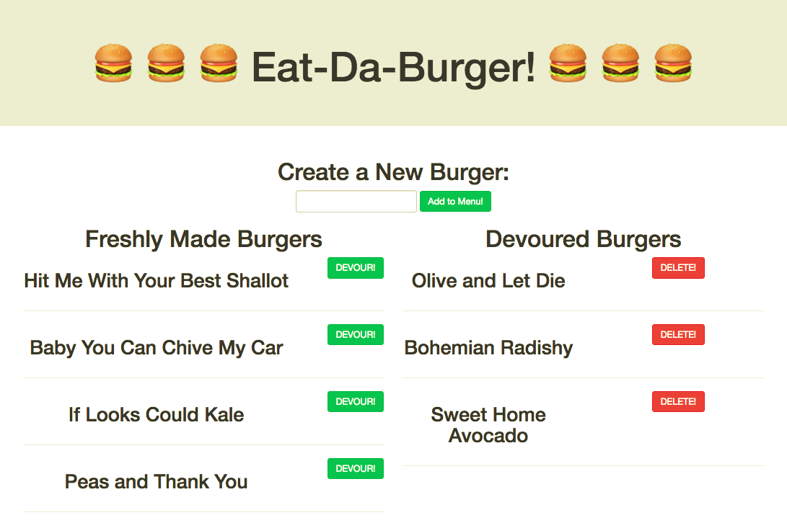
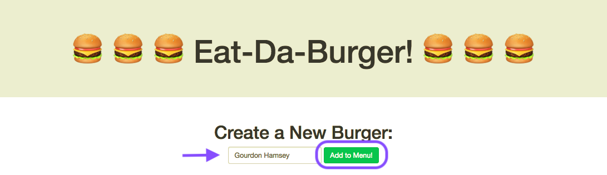
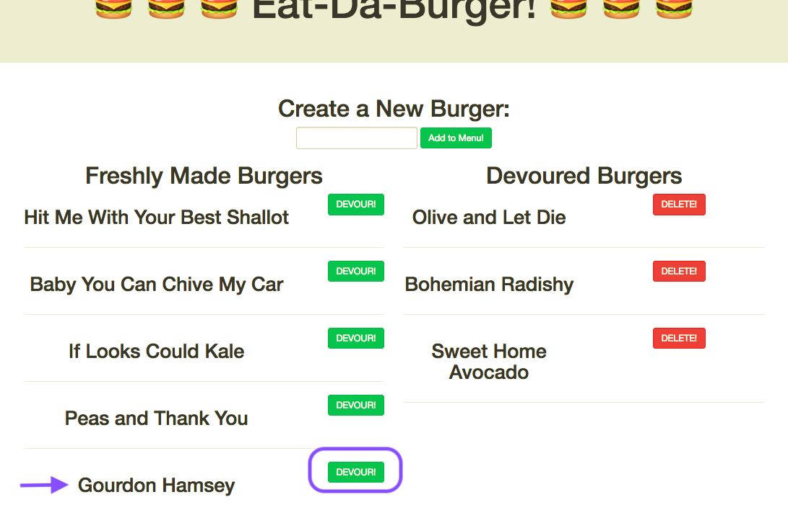
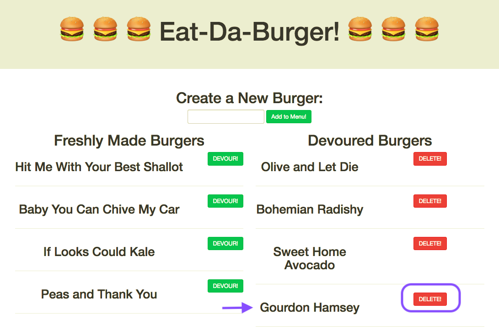

# burger
Eat-Da-Burger! is a restaurant app that lets users input the names of burgers they'd like to eat.

* Whenever a user submits a burger's name, your app will display the burger on the left side of the page -- waiting to be devoured.

* Each burger in the waiting area also has a Devour it! button. 

* When the user clicks it, the burger will move to the right side of the page.


## Getting Started
https://

## Screen Shots

## Home Page


## Add a New Burger


## Send a Freshly Made Burger to be Devoured


## Delete a Burger Once Devoured



## Technologies used
- Node.js - https://nodejs.org/en/
- body-parser NPM Package - https://www.npmjs.com/package/inquirer
- express NPM Package - https://www.npmjs.com/package/express
- express-handlebars NPM Package - https://www.npmjs.com/package/express-handlebars
- method-override NPM Package - https://www.npmjs.com/package/method-override
- mysql NPM Package - https://www.npmjs.com/package/mysql


### Prerequisites

```
- Node.js - Download the latest version of Node https://nodejs.org/en/
```

## Built With

* VS Code  - Text Editor

## Authors

* **Sonny Hughes** - *HTML/JS/Node.js* - [Sonny Hughes](https://github.com/sonnyhughes)